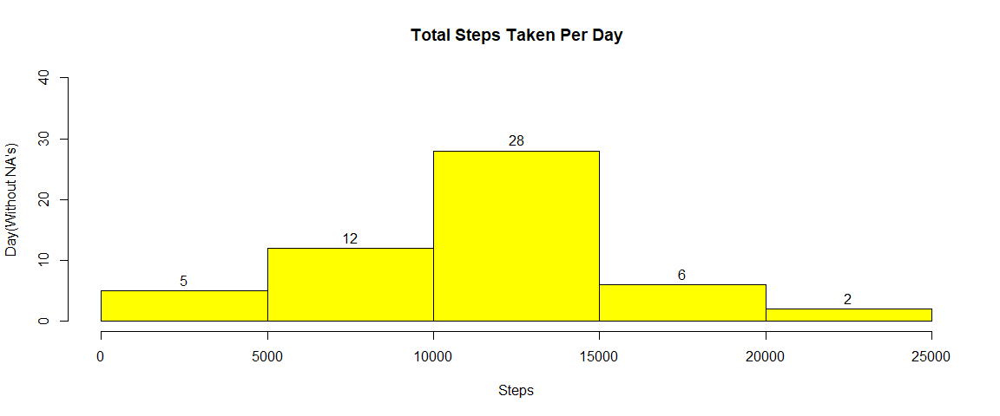
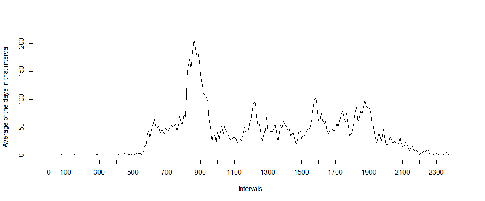
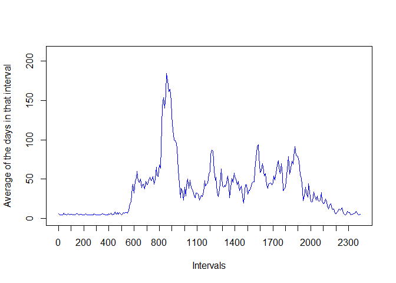
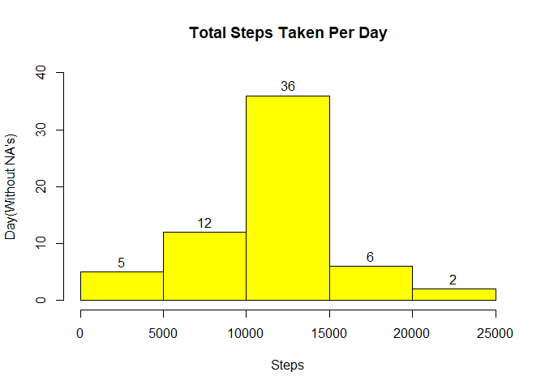
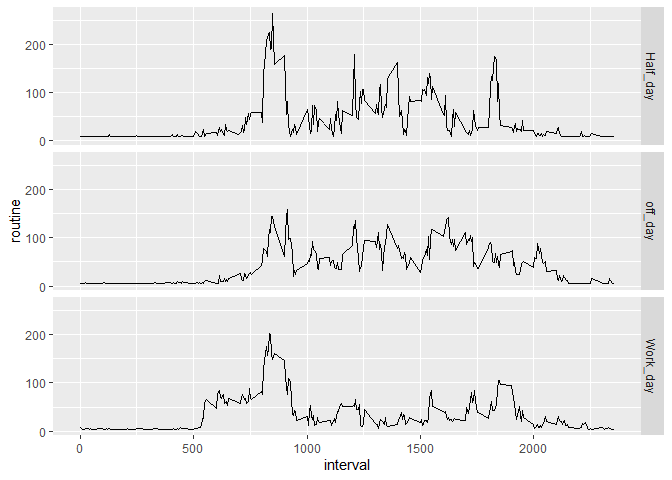

## Loading and preprocessing the data

Loading relevant dependencies


```
## Warning: package 'mice' was built under R version 4.1.2
```

Loading Data


```r
watch_ds <- read.csv("activity.csv")
summary(watch_ds)
```

```
##      steps            date              interval     
##  Min.   :  0.00   Length:17568       Min.   :   0.0  
##  1st Qu.:  0.00   Class :character   1st Qu.: 588.8  
##  Median :  0.00   Mode  :character   Median :1177.5  
##  Mean   : 37.38                      Mean   :1177.5  
##  3rd Qu.: 12.00                      3rd Qu.:1766.2  
##  Max.   :806.00                      Max.   :2355.0  
##  NA's   :2304
```

Processing Data


```r
watch_ds$date <- ymd(watch_ds$date)
watch_ds$day <- wday(watch_ds$date, label = T)
```

## What is mean total number of steps taken per day?

Carving out the Non-NA values  
The total number of steps taken per day


```r
Day_average <- watch_ds %>% 
        group_by(date) %>% 
        summarise(total_steps = sum(steps, na.rm = T), na = mean(is.na(steps)))
Day_average
```

```
## # A tibble: 61 x 3
##    date       total_steps    na
##    <date>           <int> <dbl>
##  1 2012-10-01           0     1
##  2 2012-10-02         126     0
##  3 2012-10-03       11352     0
##  4 2012-10-04       12116     0
##  5 2012-10-05       13294     0
##  6 2012-10-06       15420     0
##  7 2012-10-07       11015     0
##  8 2012-10-08           0     1
##  9 2012-10-09       12811     0
## 10 2012-10-10        9900     0
## # ... with 51 more rows
```

```r
Non_NA_Average <- aggregate(watch_ds$steps ~ watch_ds$date, FUN = sum, )
colnames(Non_NA_Average) <- c("DATE", "T_Steps")
Non_NA_Average
```

```
##          DATE T_Steps
## 1  2012-10-02     126
## 2  2012-10-03   11352
## 3  2012-10-04   12116
## 4  2012-10-05   13294
## 5  2012-10-06   15420
## 6  2012-10-07   11015
## 7  2012-10-09   12811
## 8  2012-10-10    9900
## 9  2012-10-11   10304
## 10 2012-10-12   17382
## 11 2012-10-13   12426
## 12 2012-10-14   15098
## 13 2012-10-15   10139
## 14 2012-10-16   15084
## 15 2012-10-17   13452
## 16 2012-10-18   10056
## 17 2012-10-19   11829
## 18 2012-10-20   10395
## 19 2012-10-21    8821
## 20 2012-10-22   13460
## 21 2012-10-23    8918
## 22 2012-10-24    8355
## 23 2012-10-25    2492
## 24 2012-10-26    6778
## 25 2012-10-27   10119
## 26 2012-10-28   11458
## 27 2012-10-29    5018
## 28 2012-10-30    9819
## 29 2012-10-31   15414
## 30 2012-11-02   10600
## 31 2012-11-03   10571
## 32 2012-11-05   10439
## 33 2012-11-06    8334
## 34 2012-11-07   12883
## 35 2012-11-08    3219
## 36 2012-11-11   12608
## 37 2012-11-12   10765
## 38 2012-11-13    7336
## 39 2012-11-15      41
## 40 2012-11-16    5441
## 41 2012-11-17   14339
## 42 2012-11-18   15110
## 43 2012-11-19    8841
## 44 2012-11-20    4472
## 45 2012-11-21   12787
## 46 2012-11-22   20427
## 47 2012-11-23   21194
## 48 2012-11-24   14478
## 49 2012-11-25   11834
## 50 2012-11-26   11162
## 51 2012-11-27   13646
## 52 2012-11-28   10183
## 53 2012-11-29    7047
```


## Data Visualization

Grphically seeing the data


```r
hist(Non_NA_Average$T_Steps, col = "yellow", labels = T, 
     xlab = "Steps", ylab = "Day(Without NA's)" , 
     main = "Total Steps Taken Per Day", 
     ylim = c(0,40))
```

<!-- -->

Mean & Median of total No of Steps Taken per Day including NA's


```r
mean_t_steps <- mean(Non_NA_Average$T_Steps)
mean_t_steps <- as.integer(mean_t_steps)
mean_t_steps
```

```
## [1] 10766
```

```r
median_t_steps <- as.integer(median(Non_NA_Average$T_Steps))
median_t_steps
```

```
## [1] 10765
```
The average number of steps taken each day was **10766** steps
The median number of steps taken each day was **10765** steps


## What is the average daily activity pattern?

Devising the Average Daily Step Pattern


```r
A_Mean_Day <- watch_ds %>% 
        group_by(interval) %>% 
        summarise(routine = mean(steps, na.rm = T))

plot(x = 1:nrow(A_Mean_Day), y = A_Mean_Day$routine, type = "l", 
     col = "black", xaxt = "n", xlab = "Intervals", 
     ylab = "Average of the days in that interval", 
     ylim = c(0,210))
axis(1, labels = A_Mean_Day$interval[seq(1, 288, 12)], 
     at = seq_along(A_Mean_Day$interval)[seq(1,288,12)])
```

<!-- -->

Which 5-minute interval contains the maximum number of steps?


```r
max_point <- filter(A_Mean_Day, routine == max(A_Mean_Day$routine))
max_point
```

```
## # A tibble: 1 x 2
##   interval routine
##      <int>   <dbl>
## 1      835    206.
```

Interval **835** contains an average maximum number of 
steps of about **206.17**


# Working on Imputing the Data


```r
activity <- read.csv("activity.csv")
activity$steps[which(is.na(activity$steps))] = mean(activity$steps, na.rm = T)
```


```r
Average_Day_impute <- activity %>% 
        group_by(interval) %>% 
        summarise(routine = mean(steps))
```


```r
activity$date <- ymd(activity$date)
activity$day <- wday(activity$date, label = T)
imput_Average <- aggregate(activity$steps ~ activity$date, FUN = sum, )
colnames(imput_Average) <- c("DATE", "T_Steps")
```


```r
plot(x = 1:nrow(Average_Day_impute), y = Average_Day_impute$routine, type = "l", 
     col = "blue", xaxt = "n", xlab = "Intervals", 
     ylab = "Average of the days in that interval", 
     ylim = c(0,210))
axis(1, labels = Average_Day_impute$interval[seq(1, 288, 12)], 
     at = seq_along(Average_Day_impute$interval)[seq(1,288,12)])
```

<!-- -->

```r
hist(imput_Average$T_Steps, col = "yellow", labels = T, 
     xlab = "Steps", ylab = "Day(Without NA's)" , 
     main = "Total Steps Taken Per Day", 
     ylim = c(0,40))
```

<!-- -->
Mean & Median of total No of Steps After Imputation


```r
mean_t_imp_steps <- mean(imput_Average$T_Steps)
mean_t_steps <- as.numeric(mean_t_imp_steps)
mean_t_imp_steps
```

```
## [1] 10766.19
```

```r
median_t_imp_steps <- as.integer(median(imput_Average$T_Steps))
median_t_imp_steps
```

```
## [1] 10766
```
The average number of steps taken each day was **1.0766189\times 10^{4}** steps
The median number of steps taken each day was **10766** steps


```r
activity$Day_class <- ifelse(activity$day == "Sun" | activity$day == "Sat", 
                             "off_day", ifelse(activity$day == "Fri", 
                                               "Half_day", "Work_day"))
activity$Day_class <- as.factor(activity$Day_class)
activity$steps <- as.numeric(activity$steps)
```


```r
Day_class_Mean <- activity %>% 
        group_by(interval, Day_class) %>% 
        summarise(routine = mean(steps))
```

```
## `summarise()` has grouped output by 'interval'. You can override using the `.groups` argument.
```


```r
qplot(interval, routine, data = Day_class_Mean,geom = "line" ,
      facets = Day_class ~.)
```

<!-- -->


